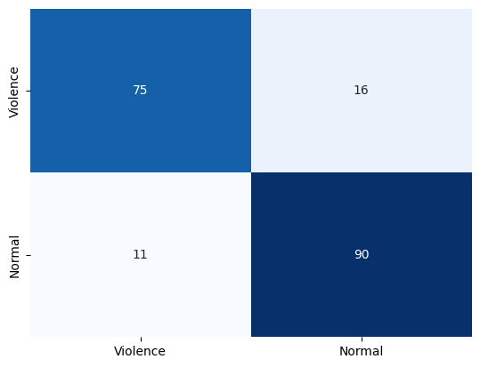
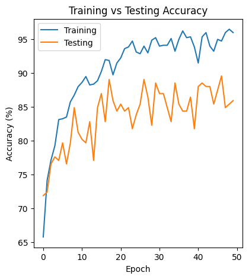
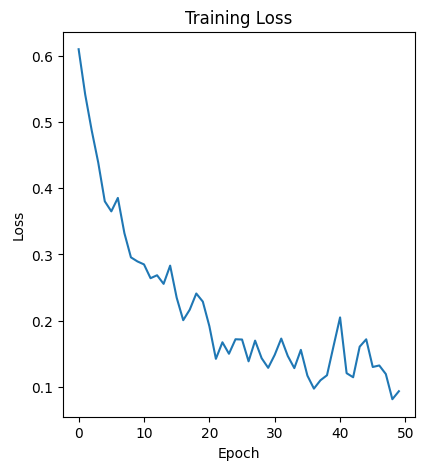

# Violence Detection using Adapted DenseNet with Convolutional LSTM

## Description

This project is focused on identifying instances of violence in video sequences through the use of deep learning. Drawing inspiration from [ViolenceNet](https://github.com/FernandoJRS/violence-detection-deeplearning), we have employed a customized & adapted version of the Densenet121 model, enhanced with convLSTM cells, to analyze video frames and make predictions about the presence of violence. To capture temporal information, optical flow was utilized as the model's input. Contrary to the approach used in the original paper that inspired us, we implemented frame skipping on the optical flow due to memory and computation constraints. Additionally, we used a minimized version of densenet (i.e., less channels/neurons) due to the same constraints.

## Technologies Used

This project is implemented using Python and the following libraries:

- [OpenCV](https://opencv.org/): Used for real-time computer vision to read and manipulate images and videos.
- [NumPy](https://numpy.org/): Used for numerical computations in Python.
- [PyTorch](https://pytorch.org/): An open-source machine learning library used to create and train the neural network.
- [Pandas](https://pandas.pydata.org/): Used for data manipulation and analysis.
- [Torchvision](https://pytorch.org/vision/stable/index.html): Used to load the pre-trained Densenet121 model and perform image transformations.
- [Matplotlib](https://matplotlib.org/): Used for creating static, animated, and interactive visualizations in Python.
- [Seaborn](https://seaborn.pydata.org/): A Python data visualization library based on Matplotlib. It provides a high-level interface for drawing attractive and informative statistical graphics.
- [tqdm](https://tqdm.github.io/): A fast, extensible progress bar for Python and CLI.
- [Scikit-learn](https://scikit-learn.org/stable/): A machine learning library in Python. It features various classification, regression and clustering algorithms.
- [ConvLSTM](https://github.com/ndrplz/ConvLSTM_pytorch): Used to add ConvLSTM layers to the model.

## Installation

1. Clone this repository:
   ```
   git clone https://github.com/akvnn/violence-detection
   ```
2. Install the required packages:
   ```
   pip install -r requirements.txt
   ```

## Usage

To use the violence detection model, run the cells in the `app.ipynb` Jupyter Notebook File

**Note that the first half of the cells is for model training and the second half is for model inference**

**Please read comments and markdown cells before running a cell.**

## Dataset

The dataset used for this project can be found on Kaggle: [Hockey Fights](https://www.kaggle.com/datasets/yassershrief/hockey-fight-vidoes/data)

## Results

In our experiments, the adapted Densenet121 model demonstrated promising results in detecting violence in video sequences. The model achieved an accuracy of 55%, a weighted precision of 76%, a weighted recall of 55%, and a weighted F-score of 41%. These metrics indicate that the model overfitted.

The performance of the model is further illustrated in the images below, which show the final confusion matrix, a plot of the training accuracy over epochs, and a plot of the training loss over epochs, respectively.







## Credits

This project was developed as the course project for the Computer Vision course at American University of Sharjah by [Ahmed](https://github.com/akvnn), [Mohammed](https://github.com/m7mdhussamaus), [Said](https://github.com/Said-Iqelan), [Youssef](https://github.com/y-ghoneim)

## License

This project is under the [MIT License](./LICENSE).
